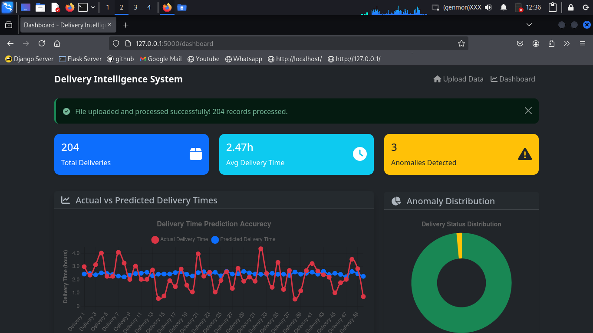

---

# Delivery Intelligence System

**Team**: Kilitech Duo  
**Team Members**: Faustine Emmanuel, Cleven Godson  
**Mentor**: Mr. Madaraka Masasi  
**Hackathon**: Digital Clubs HACKATHON - 2025  
**Presented to**: Tanzania Communications Regulatory Authority (TCRA)

---

## Problem

Tanzania’s postal and courier sector struggles with unpredictable delivery times, inefficiencies, and potential fraud. Manually analyzing 470k+ delivery records ```(delivery_five_cities_tanzania.csv)``` is slow and error-prone, hindering optimization.

### Challenge:
1. Predict parcel delivery completion times.
2. Detect anomalies (e.g., fraud, operational issues).

---

## Solution

Our **Delivery Intelligence System** is a Flask-based web app that uses AI to:
- Predict delivery times with linear regression.
- Detect anomalies using statistical Z-scores.
- Visualize insights via an interactive dashboard.

### Live Demo:
- [anna2tx.pythonanywhere.com](http://anna2tx.pythonanywhere.com)

---

## Key Algorithms and Code Snippets

### 1. Delivery Time Prediction

**Algorithm**: Linear regression (NumPy) for fast, reliable predictions.  
**Features**: Distance, hour of day, day of week, peak hours.

#### Snippet (ml_model.py - `DeliveryPredictor`):
```python
class DeliveryPredictor:
    def train(self, data):
        X, y = self._prepare_features(data)
        X_normalized = (X - np.mean(X, axis=0)) / (np.std(X, axis=0) + 1e-8)
        X_with_bias = np.column_stack([np.ones(X_normalized.shape[0]), X_normalized])
        theta = np.linalg.solve(X_with_bias.T @ X_with_bias, X_with_bias.T @ y)
        self.intercept, self.weights = theta[0], theta[1:]
        self.is_trained = True
````

---

### 2. Anomaly Detection

**Algorithm**: Z-score and modified Z-score to flag outliers (>2.5σ).

#### Snippet (ml\_model.py - `AnomalyDetector`):

```python
class AnomalyDetector:
    def detect_anomalies(self, data):
        delivery_times = data['actual_delivery_time'].values
        mean_time = np.mean(delivery_times)
        std_time = np.std(delivery_times)
        z_scores = np.abs((delivery_times - mean_time) / std_time)
        anomalies = [
            {'index': idx, 'actual_time': delivery_times[idx], 'anomaly_type': 'Long' if delivery_times[idx] > mean_time + 2.5 * std_time else 'Short'}
            for idx in np.where(z_scores > 2.5)[0]
        ]
        return {'anomalies': anomalies}
```

---

### 3. Data Processing

**Process**: Cleans timestamps, engineers features, handles 470k+ records.

#### Snippet (data\_processor.py - `load_and_clean_data`):

```python
class DataProcessor:
    def load_and_clean_data(self, filepath, chunk_size=50000):
        if os.path.getsize(filepath) > 50 * 1024 * 1024:
            df = self._load_large_file_chunked(filepath, chunk_size)
        else:
            df = pd.read_csv(filepath)
        df = self._clean_timestamps(df)
        df = self._engineer_features(df)  # Adds distance, hour_of_day
        return df
```

---

### 4. Flask API for Chart.js

**Purpose**: Serves data for interactive visualizations (actual vs. predicted, anomalies, city analysis).

#### Snippet (app.py - `get_chart_data`):

```python
@app.route('/api/chart-data')
def get_chart_data():
    try:
        chart_data = prepare_chart_data()  # Samples data for performance
        return jsonify(chart_data)
    except Exception as e:
        app.logger.error(f"Error: {str(e)}")
        return jsonify({'error': 'Failed to prepare chart data'}), 500
```

---

## UI/UX

### Design:

* Responsive, dark-themed dashboard using Bootstrap and Chart.js.

### Features:

* **Upload Page**: Clean interface for CSV uploads (up to 250MB).
* **Dashboard**:

  * **Stats**: total deliveries, average time, anomalies, accuracy.
  * **Charts**: Line (actual vs. predicted), Doughnut (anomalies), Bar (city analysis).
   <br> <br>
   <br> <br>
  

---

## Robustness and Scalability

### Robustness:

* Chunked processing for 470k+ records.
* Extensive error handling (e.g., invalid CSVs, missing columns).
* Logging for debugging and tracing.

### Scalability:

* Modular code (separate data, ML, and API logic).
* Supports large datasets via chunking.
* Deployed on PythonAnywhere; ready for cloud scaling (e.g., AWS).

---

## Impact 

### Business Value:

* Reduces delays and fraud, saving costs (e.g., 5% anomaly detection could cut losses up to 20%).

### Innovation:

* Custom features (e.g., peak-hour analysis) fitted for Tanzania.

### UX:

* Intuitive dashboard empowers Postal and Courier sector to optimize logistics.

---
